# TP1 – Modern Computer Vision

## Initialisation

### Dépôt
Lien du dépôt Git : https://github.com/HamzaCharfeddine/CSC8608_Hamza_Charfeddine

### Environnement d’exécution
- Cluster : Télécom SudParis (SLURM)
- Accès : SSH depuis Windows (WSL2)
- Allocation GPU : `srun --gres=gpu:1`
- GPU : NVIDIA H100 NVL (MIG 1g.12gb)
- Environnement Python : conda `sam_tp1`
- Python : 3.10
- PyTorch : 2.5.1 (CUDA 12.1)
- CUDA disponible : True

### Arborescence
TP1/
├── data/images
├── models
├── outputs/overlays
├── outputs/logs
├── src
├── report

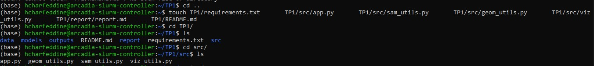

> *conda activate sam_tp1*

> *python -c "import torch; print('torch', torch.__version__); print('cuda_available', torch.cuda.is_available()); print('device_count', torch.cuda.device_count())"*

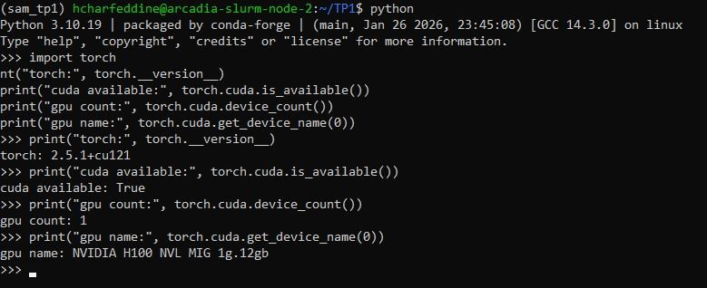

> *python -c "import streamlit, cv2, numpy; print('ok'); import segment_anything; print('sam_ok')"*

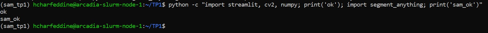


- PORT=8888

> *streamlit run src/app.py --server.port $PORT --server.address 0.0.0.0*

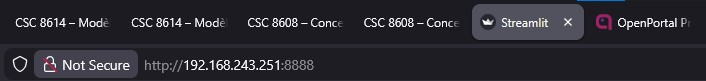

- UI accessible via SSH tunnel : oui

## Constituer un mini-dataset

- Les 8 images ont été récupérées via recherche web.


> *ls -lah TP1/data/images | head*

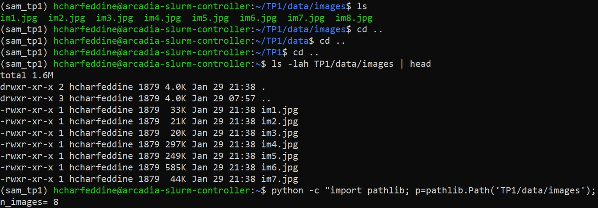


- "im1" - "im3" : simples (avec un fond clair)
- "im4" - "im6" : chargées (cuisine, bureau, rue animée)
- "im7" - "im8" : difficiles (reflet + nuit, veranda en verre)

## Charger SAM (GPU) 


- Modèle utilisé : SAM ViT-H
- Checkpoint : `sam_vit_h_4b8939.pth` (non inclus dans le dépôt)
- Device : CUDA (NVIDIA H100 NVL – MIG 1g.12gb)

> *wget https://dl.fbaipublicfiles.com/segment_anything/sam_vit_h_4b8939.pth*

> *ls -lah TP1/models*

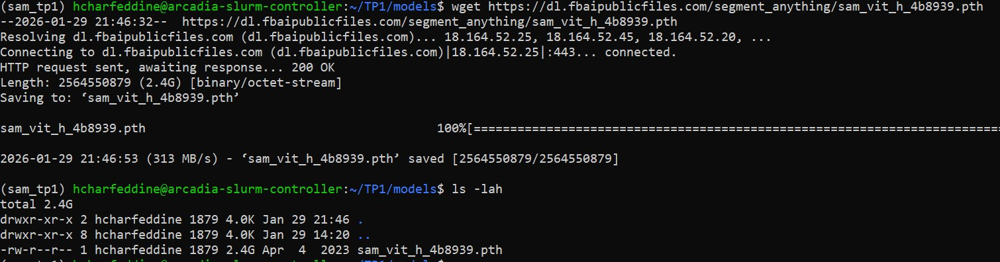

> *python TP1/src/quick_test_sam.py*

```
img (2419, 3628, 3)
mask (2419, 3628)
score 0.8073744773864746
mask_sum 14729
```

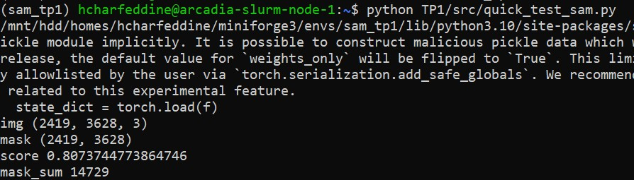

- Le modèle SAM se charge correctement sur GPU et produit un masque cohérent à partir d’une bounding box. L’inférence est rapide pour une image unique. La qualité dépend fortement de la précision de la bounding box.

## Mesures et visualisation

> *python TP1/src/quick_test_overlay.py*

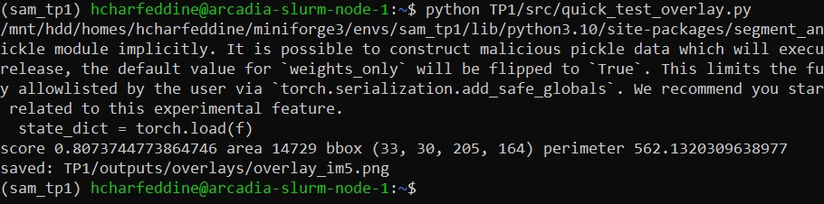


| Image   | Score | Aire (px) | Périmètre |
| ------- | ----- | --------- | --------- |
| im1.jpg | 0.807 | 39 494    | 1429.75   |
| im2.jpg | 0.874 | 52 388    | 2001.07   |
| im5.jpg | 0.807 | 14 729    | 562.13    |

- L’overlay permet de visualiser rapidement si la région segmentée correspond réellement à l’objet attendu. Dans les images, SAM produit un masque cohérent géométriquement mais incorrect sémantiquement, par exemple en segmentant une zone de fond uniforme. Cela montre que des scores élevés ne garantissent pas une bonne interprétation de l’image. L’overlay aide donc à détecter des prompts mal positionnés ou insuffisamment informatifs. Il est particulièrement utile pour diagnostiquer les échecs sur des scènes complexes ou à fort fond blanc. Enfin, il met en évidence la nécessité de prompts plus précis (points multiples ou bbox ajustées).


## Mini-UI Streamlit


- Cas simple:

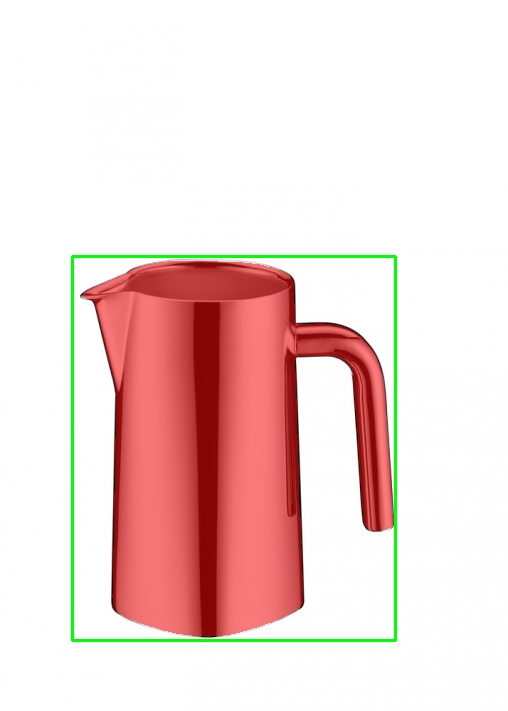

```
{
	"score":1.0119367837905884
	"time_ms":2107.527256011963
	"area_px":75252
	"mask_bbox":[
		0:83
		1:261
		2:392
		3:636
	]
	"perimeter":1606.2396756410599
}
```


- Cas difficile:

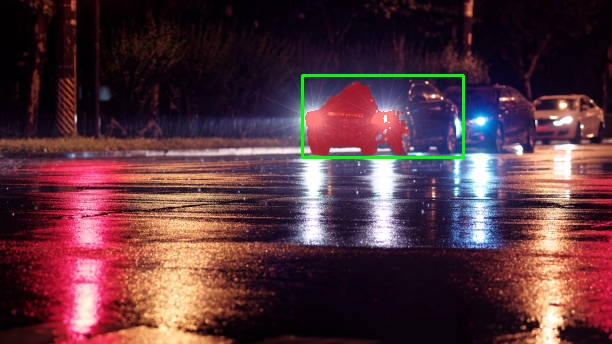

```
{
	"score":0.9217934012413025
	"time_ms":1651.109218597412
	"area_px":4733
	"mask_bbox":[
		0:305
		1:82
		2:408
		3:155
	]
	"perimeter":410.2914105653763
}
```


- Cas moyen:

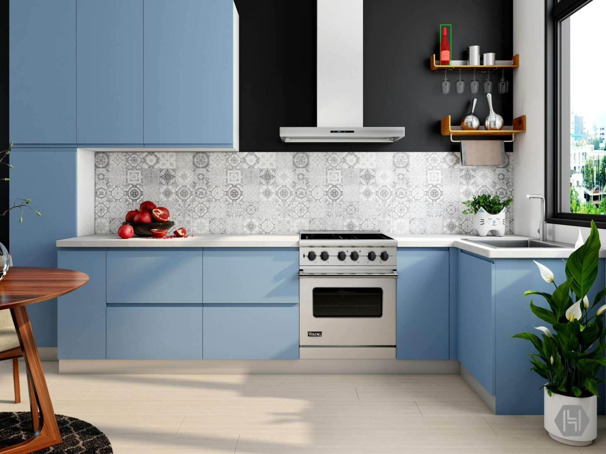


```
{
	"score":0.9761278629302979
	"time_ms":1681.9331645965576
	"area_px":8268
	"mask_bbox":[
		0:2321
		1:144
		2:2376
		3:345
	]
	"perimeter":478.7523066997528
}
```

- Lorsqu'on agrandit la bbox, on observe que le masque tend à capturer plus d'éléments de contexte (fond, objets adjacents), ce qui peut faire baisser le score si plusieurs objets plausibles sont présents. Lorsqu'on rétrécit la bbox, on force SAM à se concentrer sur une zone précise : si la bbox est bien centrée sur l'objet, le score monte (im1 : score 1.01) et le masque est plus net. Cependant, une bbox trop serrée peut tronquer l'objet ou ne segmenter qu'une partie. En pratique, une bbox légèrement plus large que l'objet visé donne les meilleurs résultats, car elle fournit du contexte sans ambiguïté. Les cas difficiles (reflets, verre, nuit) restent sensibles même avec une bbox optimale.


## Affiner la sélection de l'objet

### Première image sans le point FG : 

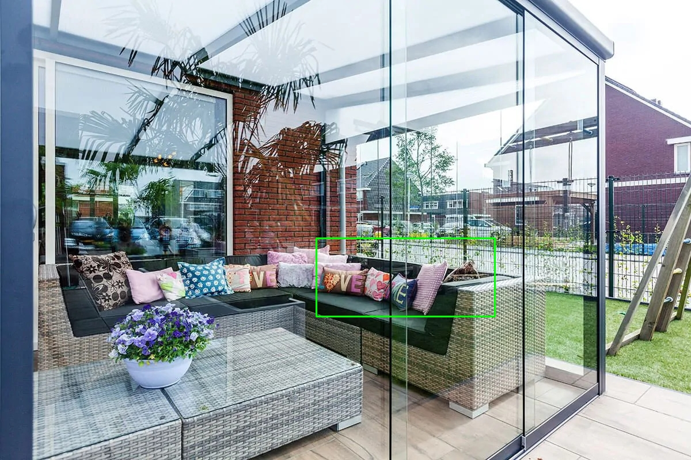

=> Sur Streamlit, ça donne (index du masque = 2): 


=> Sur Streamlit, ça donne (index du masque = 1): 

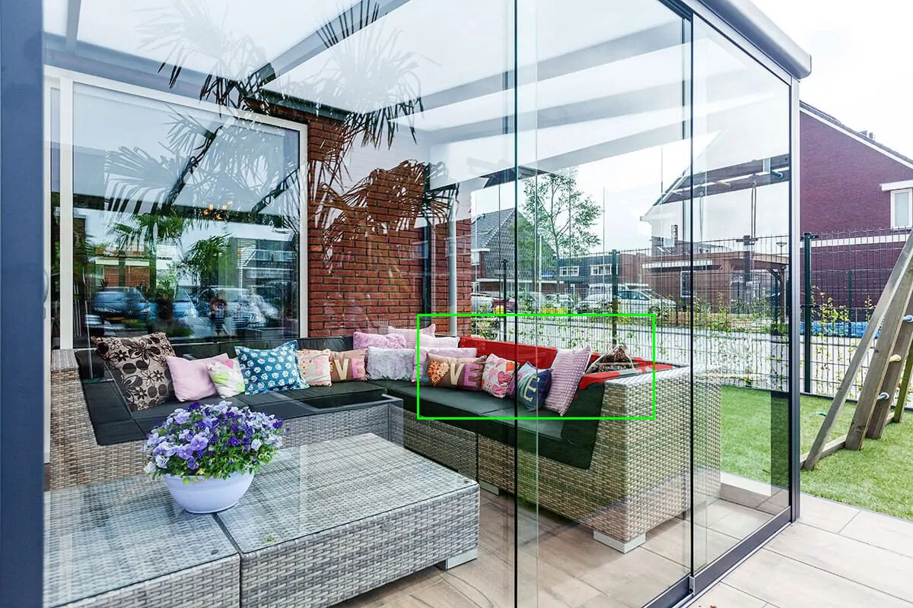


- Le masque capture les coussins roses mais de manière imprécise, avec des zones floues. SAM hésite entre plusieurs interprétations possibles car la bbox contient plusieurs objets (coussins, canapé). 

- Le masque d’index 2 présente une meilleure couverture de l’objet d’intérêt que celui d’index 1.

### Première image avec un point FG :

```
{
  "n_points": 1,
  "points": [
    [
      707,
      517,
      1
    ]
  ]
}
```


=> Sur Streamlit, ça donne (index du masque = 2): 

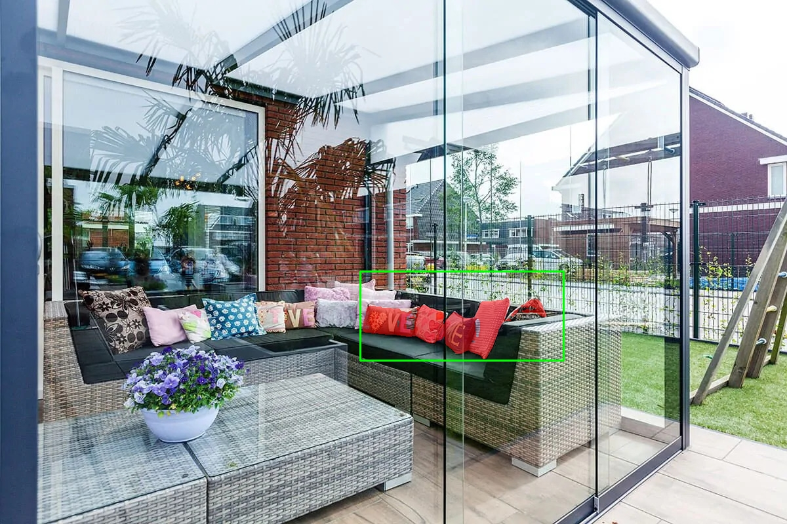

- Le point FG placé directement sur les coussins améliore considérablement la précision. Le masque est plus net et capture mieux les contours.


### Deuxième image sans point FG :


- La bbox encadre le tuktuk.

### Deuxième image avec 2 points FG (index = 2):

```
{
  "n_points": 2,
  "points": [
    [
      1348,
      1195,
      1
    ],
    [
      1348,
      1112,
      1
    ]
  ]
}
```


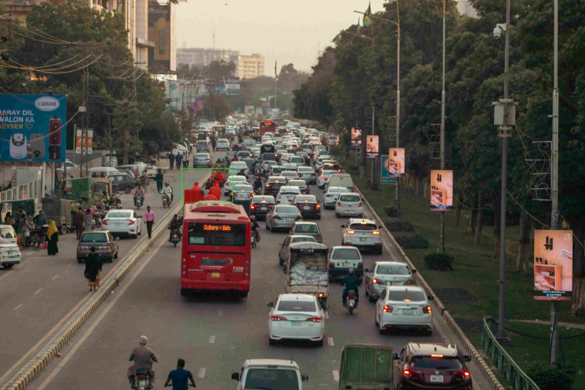


- L'ajout de 2 points FG a ajusté la cible de segmentation. En plus du petit tuktuk, SAM a segmenté les personnes dans la même zone. Cela montre que le placement des points FG est critique.

- Dans ce cas, la différence entre les masques d’index 1 et 2 est relativement faible, tandis que le masque d’index 0 présente une segmentation très différente et incorrecte.

## Bilan et réflexion

### Les 3 principaux facteurs d'échec observés sur les images sont :

1. **Ambiguïté de la bbox** : Quand la bbox contient plusieurs objets candidats (tuktuk + personnes, canapé + coussins + reflets), SAM doit "deviner" l'intention. **Action** : Forcer une bbox plus serrée avec contrainte de taille minimale/maximale dans l'UI

2. **Transparence et reflets** : Les surfaces vitrées (véranda, fenêtres) créent des confusions visuelles entre l'objet réel et son reflet. **Action** : (a) Post-traitement basé sur la détection de contours pour nettoyer les zones de reflet.

3. **Placement imprécis des points FG/BG** : Comme observé dans le cas 2, des points FG mal placés changent radicalement la segmentation. **Actions** : (a) Ajouter une prévisualisation en temps réel du masque pendant le placement des points (feedback immédiat), (b) Implémenter un système de "undo/redo" pour les points (actuellement que le "reset"), (c) Permettre le glisser-déposer des points existants au lieu de devoir les recréer.


### Logging et monitoring pour industrialisation

Si je devais industrialiser cette brique, voici les 5 éléments prioritaires à logger et monitorer :

1. **Temps d'inférence (ms) par image et par taille** : Logger systématiquement le temps d'exécution de SAM avec la résolution de l'image en entrée. Calculer les percentiles (p50, p95, p99) et alerter si le p95 dépasse 3000ms. Cela permet de détecter des régressions de performance ou des images pathologiques qui ralentissent le système.

2. **Distribution des scores de confiance** : Logger le meilleur score retourné par SAM pour chaque segmentation. Tracker la distribution hebdomadaire et alerter si la médiane descend sous 0.85 ou si le pourcentage de scores < 0.7 dépasse 15%. Un drift vers le bas signalerait que les images en production diffèrent du dataset d'origine (nouveau type de scènes, qualité dégradée).

3. **Nombre et type de points utilisés (FG/BG)** : Logger combien de points l'utilisateur a dû ajouter avant d'être satisfait, et le ratio FG/BG. Si les utilisateurs ajoutent systématiquement 3+ points ou un ratio BG élevé (>30%), cela indique que la bbox seule ne suffit plus et qu'il faut revoir le prompting ou fine-tuner le modèle.

4. **Taux de réessais et abandons** : Tracker combien de fois l'utilisateur relance la segmentation sur la même image (clicks sur "Segmenter" répétés) et combien de fois il abandonne sans sauvegarder. Un taux de réessai > 40% ou d'abandon > 20% signale une expérience utilisateur dégradée ou des cas d'usage non couverts.

5. **Caractéristiques des masques produits** : Logger l'aire du masque (en % de l'image totale), le ratio périmètre/aire (complexité), et le nombre de composantes connexes. Des masques anormalement petits (<1% de l'image) ou fragmentés (>5 composantes) indiquent des échecs de segmentation. Des masques trop larges (>80% de l'image) suggèrent une bbox mal définie ou un fond segmenté par erreur.

Ces métriques permettraient de détecter rapidement des régressions (temps, qualité), du drift (changement de distribution des images), et des problèmes UX (utilisateurs en difficulté), tout en fournissant des données actionnables pour prioriser les améliorations.
