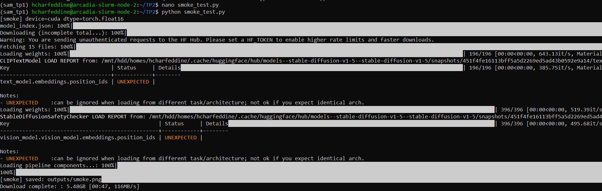
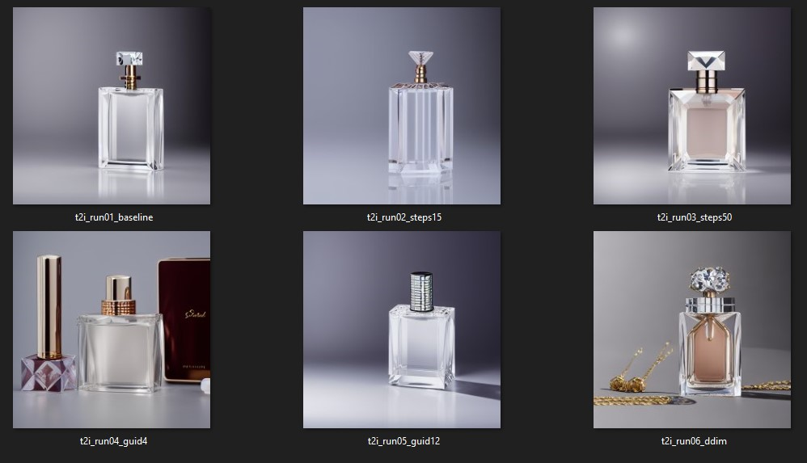
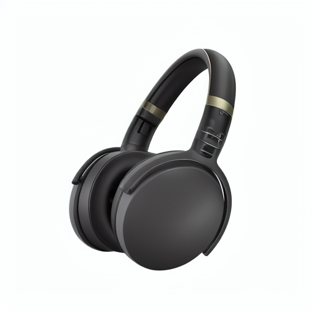
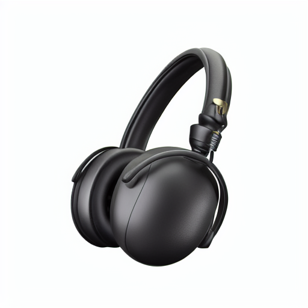
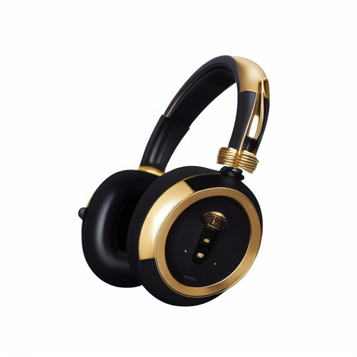
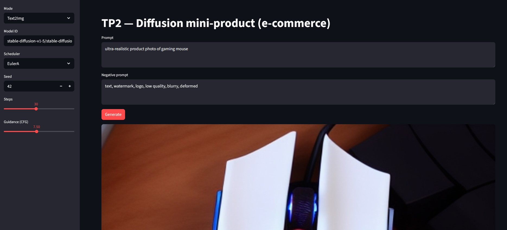
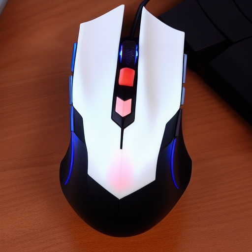
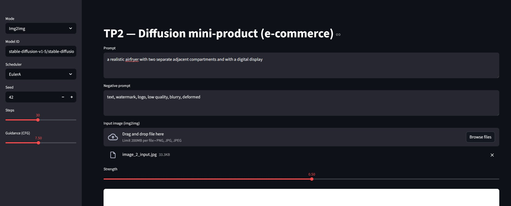
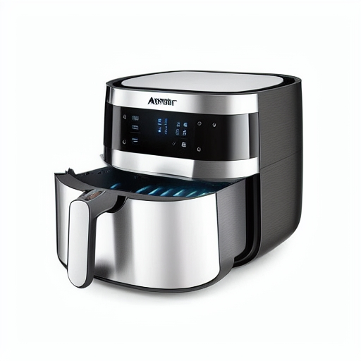
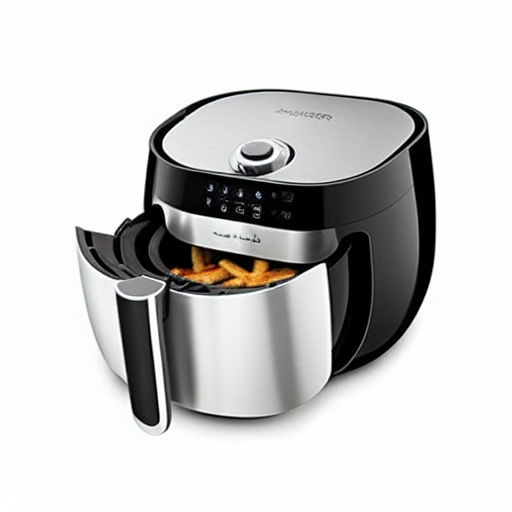

# TP2 – Génération d'image

## Initialisation

### Dépôt
Lien du dépôt Git : https://github.com/HamzaCharfeddine/CSC8608_Hamza_Charfeddine

### Environnement d’exécution
- Cluster : Télécom SudParis (SLURM)
- Accès : SSH depuis Windows (WSL2)
- Allocation GPU : `srun --gres=gpu:1`
- GPU : NVIDIA H100 NVL (MIG 1g.12gb)
- Environnement Python : conda `sam_tp1`
- Python : 3.10
- PyTorch : 2.5.1 (CUDA 12.1)
- CUDA disponible : True

### Arborescence
TP2/
├── inputs/
├── outputs/
├── smoke_test.py
├── pipeline_utils.py
├── experiments.py
├── app.py
└── report.md

## Mise en place & smoke test

> *python smoke_test.py*




- Le modèle génère une montre réaliste avec un fond blanc 512 x 512 (comme demandé). Le bracelet en cuir et le cadran sont bien rendus. Aucun problème OOM rencontré grâce à `enable_attention_slicing()` et `torch.float16`.

## Factoriser le chargement du pipeline

- Configuration baseline:
```
{
  "model_id": "stable-diffusion-v1-5/stable-diffusion-v1-5",
  "scheduler": "EulerA",
  "seed": 42,
  "steps": 30,
  "guidance": 7.5
}
```

- Prompt utilisé : "ultra-realistic product photo of a backpack on a white background, studio lighting, soft shadow, very sharp"

- Résultat baseline:


- Obesrvations: Le modèle génère un sac à dos noir moderne avec plusieurs vues (3 angles différents). La composition est professionnelle avec un fond dégradé gris-blanc et des ombres douces. Le rendu 3D est réaliste.

## Text2Img : 6 expériences contrôlées

- Modèle : stable-diffusion-v1-5

> *python experiments.py*





**Effet de `num_inference_steps`** :
- Steps=15 (run02) : forme correcte mais reflets simplifiés.
- Steps=50 (run03) : meilleure qualité visuelle.

**Effet de `guidance_scale`** :
- Guidance=4.0 (run04) : plus créatif, génère une scène complète (plusieurs objets), moins fidèle au prompt singulier
- Guidance=12.0 (run05) : très fidèle au prompt, image simple et épurée, rendu plus rigide

**Effet du `scheduler`** :
- DDIM (run06) vs EulerA (run01) : style visuel différent, DDIM ajoute plus de détails décoratifs
- Les deux produisent des images de qualité, mais avec des interprétations différentes du même prompt


## Img2Img : 3 expériences contrôlées

> *python experiments.py*

- Strength = 0.35 (i2i_run07_strength035.png) :



- Strength = 0.60 (i2i_run08_strength060.png) :



- Strength = 0.85 (i2i_run09_strength085.png) :



### Observations

**Ce qui est conservé** :
- Strength 0.35 : Forme globale du casque préservée, structure identifiable, position similaire
- Strength 0.60 : Silhouette générale maintenue, type de produit (casque) reconnaissable
- Strength 0.85 : Seule la catégorie "casque audio" reste, identité du produit complètement changée

**Ce qui change** :
- Strength 0.35 : Ajout léger d'accents dorés sur l'arceau, fond légèrement modifié, textures affinées
- Strength 0.60 : Accents dorés plus prononcés, forme des écouteurs légèrement arrondie, éclairage transformé
- Strength 0.85 : Transformation complète : casque entièrement doré, design luxueux différent, nouveau style (bijouterie), fond et éclairage totalement réinventés

**Utilisabilité e-commerce** :
- Strength 0.35 : **Utilisable** - légère amélioration esthétique du produit original, identité préservée
- Strength 0.60 : **Risque moyen** - le produit est différent mais reste crédible comme variante du même modèle
- Strength 0.85 : **Non utilisable** - produit totalement différent, risque de représentation trompeuse, dérive créative excessive pour l'e-commerce


## Mini-produit Streamlit (MVP)

### Text2Img

**Configuration utilisée** :

```
{
  "mode": "Text2Img",
  "model_id": "stable-diffusion-v1-5/stable-diffusion-v1-5",
  "scheduler": "EulerA",
  "seed": 42,
  "steps": 30,
  "guidance": 7.5,
  "height": 512,
  "width": 512
}
```




- Prompt : ultra-realistic product photo of gaming mouse




- Observation : L'interface permet de générer rapidement des produits à partir de prompts. La souris gaming générée est réaliste avec éclairage RGB.

### Img2Img


**Configuration utilisée** :
```
{
  "mode": "Img2Img",
  "model_id": "stable-diffusion-v1-5/stable-diffusion-v1-5",
  "scheduler": "EulerA",
  "seed": 42,
  "steps": 30,
  "guidance": 7.5,
  "strength": 0.6,
  "height": 512,
  "width": 512
}
```




- Prompt : a realistic airfryer with two separate adjacent compartments and with a digital display



- Avec strength = 0.85 :





- Observation : L'interface permet de transformer un produit existant. L'air fryer a été modifié pour ajouter deux compartiments et un affichage digital, mais le résultat ne donne toujours qu'un seul compartiment.


## Évaluation + Réflexion

#### 1. Text2Img Baseline (run01 - Parfum)

**Scores** :
- Prompt adherence : 2/2 (flacon de parfum luxueux en verre, fond studio)
- Visual realism : 2/2 (reflets, transparence, éclairage réalistes)
- Artifacts : 2/2 (aucun artefact visible)
- E-commerce usability : 2/2 (publiable après retouche fond)
- Reproducibility : 2/2 (tous paramètres documentés)

**Total : 10/10**

**Justification** :
- Image très propre et professionnelle
- Respect strict du prompt (luxury perfume bottle, crystal glass)
- Seul défaut : fond gris au lieu de blanc pur (correction facile)

#### 2. Text2Img Guidance élevé (run05 - guidance=12.0)

**Scores** :
- Prompt adherence : 2/2 (flacon de parfum identifiable)
- Visual realism : 1/2 (aspect trop "propre", reflets artificiels)
- Artifacts : 2/2 (pas d'artefacts majeurs)
- E-commerce usability : 1/2 (utilisable mais manque de naturel)
- Reproducibility : 2/2 (paramètres documentés)

**Total : 8/10**

**Justification** :
- Guidance trop élevée produit une image rigide
- Moins de détails subtils dans les reflets
- Aspect "trop parfait" = moins crédible comme vraie photo

#### 3. Img2Img strength élevé (run09 - strength=0.85, air fryer)

**Scores** :
- Prompt adherence : 0/2 (prompt demande 2 compartiments, image n'en montre qu'un seul)
- Visual realism : 2/2 (rendu réaliste, matériaux métalliques convaincants)
- Artifacts : 2/2 (aucun artefact visible)
- E-commerce usability : 1/2 (utilisable mais ne correspond pas au prompt)
- Reproducibility : 2/2 (paramètres documentés)

**Total : 7/10**

**Justification** :
- Qualité visuelle bonne mais **échec à suivre le prompt** (1 compartiment au lieu de 2)
- L'affichage digital a été ajouté correctement (panneau de contrôle visible)
- À strength=0.85, le modèle conserve la structure de base (1 compartiment) malgré le prompt
- Montre les **limites de img2img** : changements structurels majeurs difficiles même à strength élevé

### Réflexion finale

**Compromis qualité vs coût** : L'augmentation de `num_inference_steps` de 15 à 50 améliore la qualité. En production e-commerce, un compromis à 25-35 steps semble optimal. Le choix du scheduler (EulerA vs DDIM) a peu d'impact sur le temps mais change le style : EulerA produit des résultats plus cohérents pour des photos produit standardisées.

**Reproductibilité** : Les paramètres essentiels sont : `model_id`, `scheduler`, `seed`, `steps`, `guidance_scale`, et pour img2img : `strength`. Sans seed fixe, deux générations avec mêmes paramètres produisent des résultats totalement différents.

**Risques e-commerce** : Trois risques majeurs observés : 
- **Hallucinations** : à guidance faible (4.0), le modèle génère des scènes complètes non demandées (run04 : plusieurs flacons + accessoires au lieu d'un seul). 

- **Non-respect du prompt** : même à strength élevé (0.85), img2img peut échouer à apporter des modifications structurelles (air fryer : prompt demande 2 compartiments, résultat n'en montre qu'1). 

- **Logos/texte** : le modèle génère parfois du texte illisible ou des logos fictifs (visible sur certaines générations). 

- Pour limiter ces risques : 
  - valider manuellement chaque image générée
  - en img2img, limiter strength à 0.30-0.40 pour modifications cosmétiques uniquement (fond, éclairage)
  - pour changements structurels, préférer text2img avec prompt détaillé.