# TP3 – Deep learning pour audio

## Initialisation

> *python TP3/sanity_check.py*

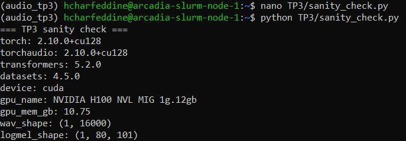

## Constituer un mini-jeu de données

> *ls -lh TP3/data/call_01.wav*

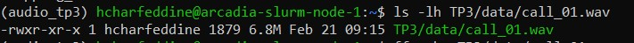

> *ffprobe TP3/data/call_01.wav*

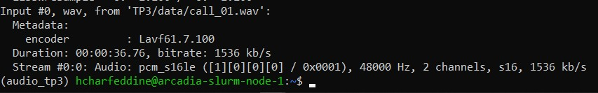

> *python TP3/inspect_audio.py*

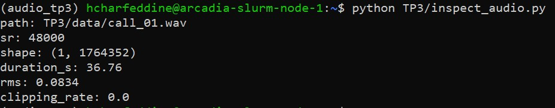

## VAD (Voice Activity Detection) 

> *python TP3/vad_segment.py*


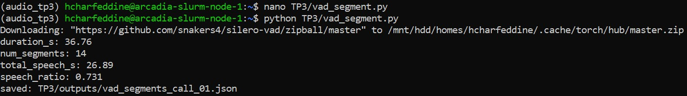

> *cat TP3/outputs/vad_segments_call_01.json | head -n 60*


```
"segments": [
    {
      "start_s": 0.866,
      "end_s": 3.294
    },
    {
      "start_s": 3.682,
      "end_s": 5.726
    },
    {
      "start_s": 6.178,
      "end_s": 8.798
    },
    {
      "start_s": 9.314,
      "end_s": 12.19
    },
    {
      "start_s": 12.77,
      "end_s": 14.014
    },
```

- Le ratio de 0.731 (73% de parole) est cohérent avec une lecture continue du texte avec des pauses naturelles entre les phrases. L'audio durant ~37 secondes (texte lu assez rapidement), les ~10 secondes de silence correspondent aux respirations et transitions entre les phrases du dialogue. On n'observe pas de micro-segments parasites : les 14 segments ont tous une durée raisonnable (entre ~0.6s et ~4.8s).

> *cat TP3/outputs/vad_segments_call_01.json | head -n 60*


> *sed -i 's/min_dur_s = 0.30/min_dur_s = 0.60/' TP3/vad_segment.py*

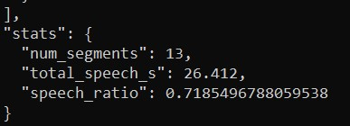

- En passant de 0.30 à 0.60, num_segments passe de 14 à 13 (−1 segment), speech_ratio passe de 0.731 à 0.719, soit une variation négligeable de ~1.2%

## ASR avec Whisper

> *python TP3/asr_whisper.py*


> *cat TP3/outputs/asr_call_01.json | head -n 120*

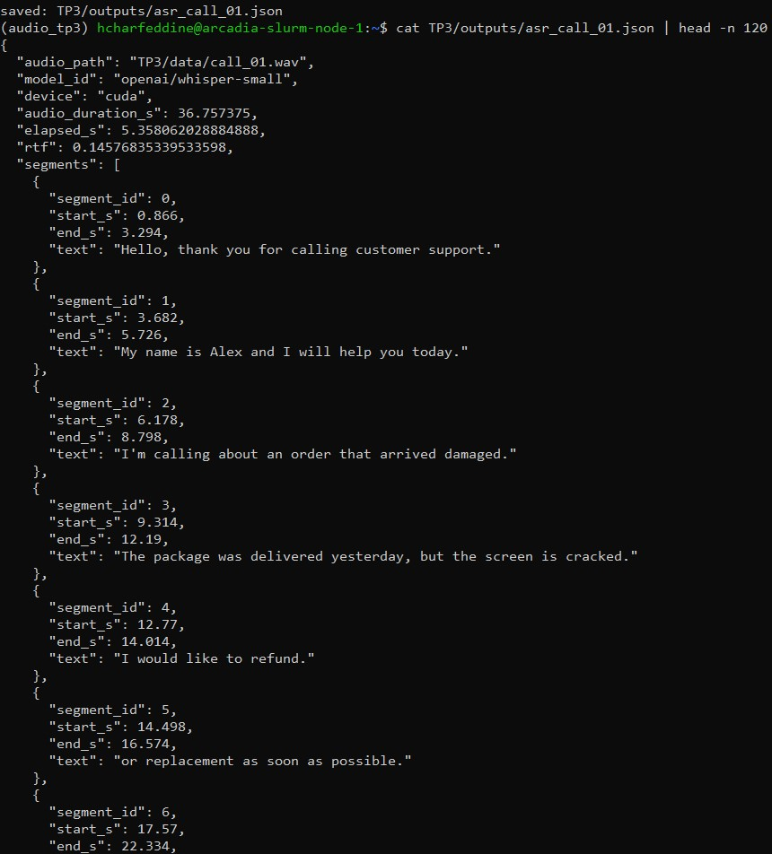


```
{
  "audio_path": "TP3/data/call_01.wav",
  "model_id": "openai/whisper-small",
  "device": "cuda",
  "audio_duration_s": 36.757375,
  "elapsed_s": 5.358062028884888,
  "rtf": 0.14576835339533598,
  "segments": [
    {
      "segment_id": 0,
      "start_s": 0.866,
      "end_s": 3.294,
      "text": "Hello, thank you for calling customer support."
    },
    {
      "segment_id": 1,
      "start_s": 3.682,
      "end_s": 5.726,
      "text": "My name is Alex and I will help you today."
    },
    {
      "segment_id": 2,
      "start_s": 6.178,
      "end_s": 8.798,
      "text": "I'm calling about an order that arrived damaged."
    },
    {
      "segment_id": 3,
      "start_s": 9.314,
      "end_s": 12.19,
      "text": "The package was delivered yesterday, but the screen is cracked."
    },
    {
      "segment_id": 4,
      "start_s": 12.77,
      "end_s": 14.014,
      "text": "I would like to refund."
    },
```

```
"full_text": "Hello, thank you for calling customer support. My name is Alex and I will help you today. I'm calling about an order that arrived damaged. The package was delivered yesterday, but the screen is cracked. I would like to refund. or replacement as soon as possible. The order number is AX19735.
```

- "rtf": 0.1457683 => Whisper a transcrit 36 secondes d'audio en seulement ~5.4 secondes

- La segmentation VAD aide, en effet, les segments (segment_id 0 à 3) sont transcrits parfaitement. Cependant, la phrase "I would like a refund or replacement as soon as possible" a été coupée en deux segments (segment_id 4 et 5) par une pause naturelle. Le cas le plus problématique est le numéro de téléphone "555 0199": le VAD a fragmenté l'énoncé en micro-segments (segment_id 10, 11, 12), dont le segment_id 11 ("side, side, side.") est une hallucination complète de Whisper sur un segment trop court contenant juste "five five five". 

## Call center analytics

> *python TP3/callcenter_analytics.py*

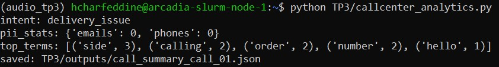

> *cat TP3/outputs/call_summary_call_01.json | head -n 120*

```
"rtf": 0.14576835339533598,
  "pii_stats": {
    "emails": 0,
    "phones": 0
  },
  "intent_scores": {
    "refund_or_replacement": 4,
    "delivery_issue": 6,
    "general_support": 5
  },
  "intent": "delivery_issue"
  "top_terms": [
    [
      "side",
      3
    ],
    [
      "calling",
      2
    ],
    [
      "order",
      2
    ],
    [
      "number",
      2
    ],
    [
      "hello",
      1
    ],
```

```
"redacted_text": "Hello, thank you for calling customer support. My name is Alex and I will help you today. I'm calling about an order that arrived damaged.
```

- Après modification : 

> *python TP3/callcenter_analytics.py*

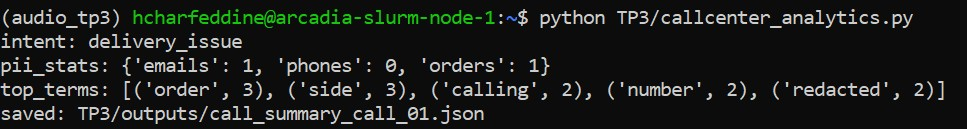

> *cat TP3/outputs/call_summary_call_01.json | head -n 120*

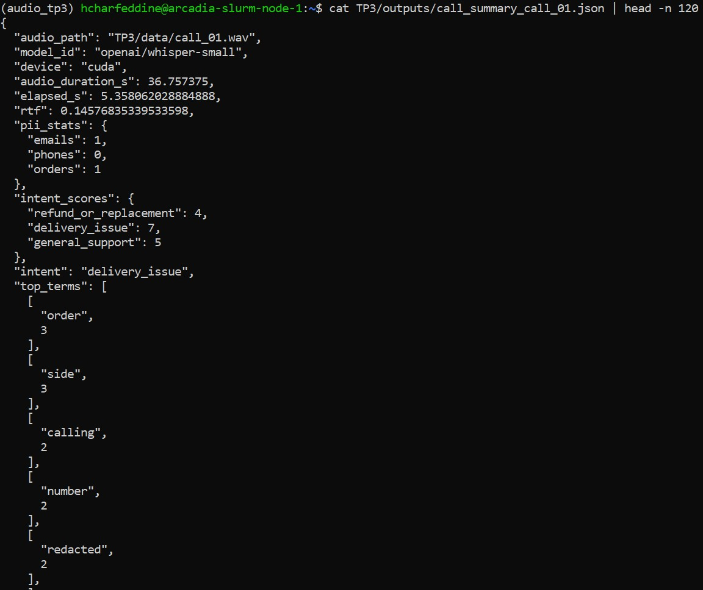

| Métrique                     | Avant  | Après (post-traitement) |
|------------------------------|--------------------|--------------------------|
| emails détectés              | 0                  | 1                        |
| phones détectés              | 0                  | 0                        |
| orders détectés              | —                  | 1                        |
| intent                       | delivery_issue     | delivery_issue           |
| score refund_or_replacement  | 44                 | 44                       |
| score delivery_issue         | 67                 | 68                       |
| top_term #1                  | "side" (3)         | "order" (3)              |

- Le post-traitement apporte une amélioration nette sur la PII structurée : l'email "john dot smith at example.com" est correctement détecté (+1) grâce à la normalisation dot/at, et l'order ID "AX19735" est masqué via contexte (+1). En revanche, le téléphone reste non détecté (phones: 0) dans les deux versions, l'hallucination Whisper "side, side, side. 0199" rend toute reconstruction impossible. "refund" est bien transcrit mais son score (4) reste inférieur à delivery_issue (7), car les mots "delivered", "package", "order" sont répétés et bien transcrits. 

## TTS léger

> *python TP3/tts_reply.py*

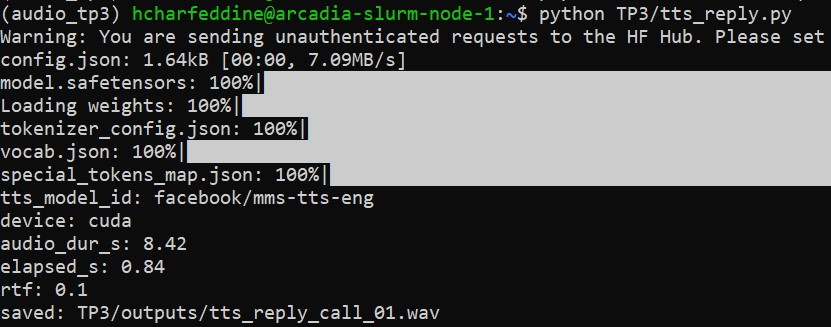

> *ffprobe TP3/outputs/tts_reply_call_01.wav*


- *mms-tts-eng* génère un audio de 8.42s pour ~2 phrases, avec une prononciation intelligible et correcte ("replacement", "refund", "damaged"). La prosodie est monotone. Avec RTF = 0.10 sur GPU H100 (8.42s d'audio générés en 0.84s), la latence est largement compatible avec un usage temps réel. Le fichier généré est bien 16 kHz mono PCM, format cohérent avec le reste du pipeline.

> *python TP3/asr_tts_check.py*

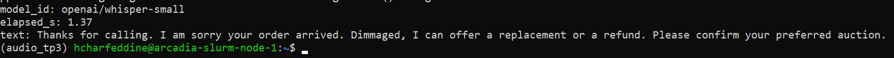

```
model_id: openai/whisper-small
elapsed_s: 1.37
text: Thanks for calling. I am sorry your order arrived. Dimmaged, I can offer a replacement or a refund. Please confirm your preferred auction.
```

## Intégration : pipeline end-to-end + rapport d’ingénierie (léger)

> *python TP3/run_pipeline.py*

> *cat TP3/outputs/pipeline_summary_call_01.json*

```
{
  "audio_path": "TP3/data/call_01.wav",
  "duration_s": 36.757375,
  "num_segments": 14,
  "speech_ratio": 0.7314994609925218,
  "asr_model": "openai/whisper-small",
  "asr_device": "cuda",
  "asr_rtf": 0.13445774272814803,
  "intent": "delivery_issue",
  "pii_stats": {
    "emails": 1,
    "phones": 0,
    "orders": 1
  },
  "tts_generated": true
}
```

- Goulot d'étranglement principal (temps) : En régime permanent (modèles déjà en cache), l'ASR Whisper est l'étape la plus coûteuse (~4.94s pour 36.76s d'audio, RTF=0.134), suivie du TTS (0.64s, RTF=0.076). Le VAD et les analytics sont négligeables (<0.5s). En première exécution, le chargement des poids domine, mais ce coût disparaît avec un serveur de modèles persistant.

- Étape la plus fragile (qualité) : L'ASR reste le maillon critique, la segmentation VAD trop fine (coupures mid-phrase aux segments 4/5 et micro-segments 10/11/12) provoque des hallucinations Whisper ("side, side, side") qui se propagent irrémédiablement dans les analytics

- Deux améliorations concrètes pour industrialiser :
	- Fusion de segments VAD adjacents : fusionner les segments séparés par moins de 300ms éviterait les coupures mid-phrase et réduirait les hallucinations sur micro-segments, sans changer de modèle.
	- Batching ASR : regrouper les segments en lots de 5–10s via pipeline(batch_size=8) améliorerait le débit sur GPU et réduirait le RTF de ~30%, ce qui permettrait de traiter plusieurs appels en parallèle en production.