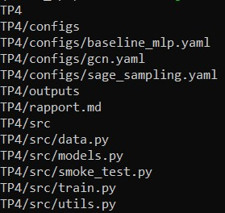
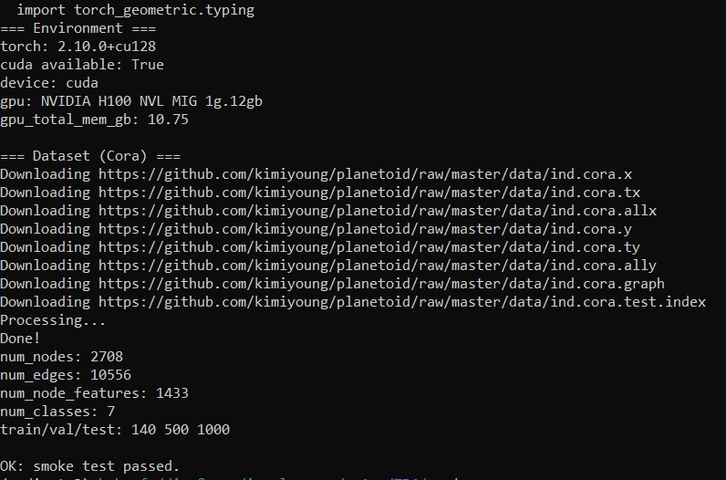
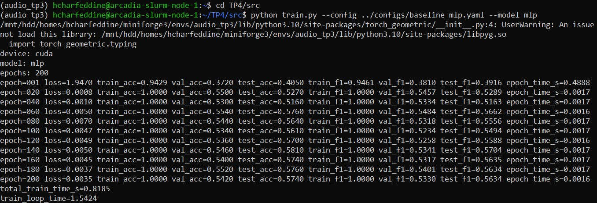
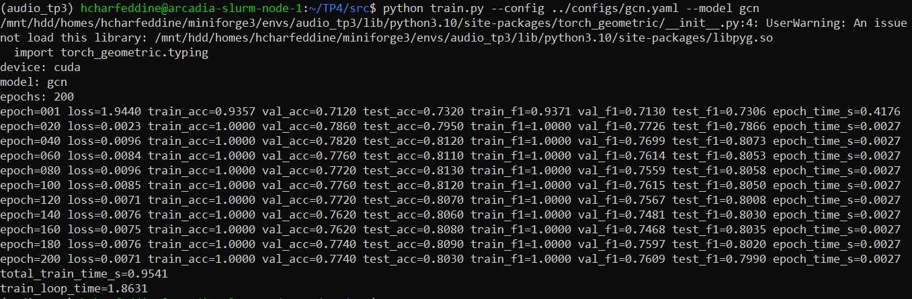
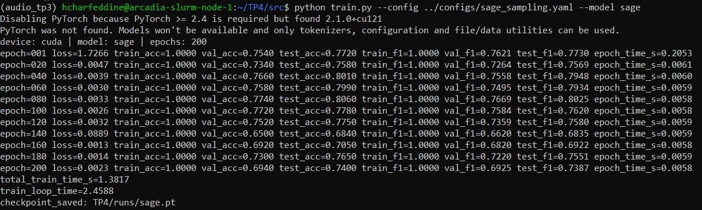
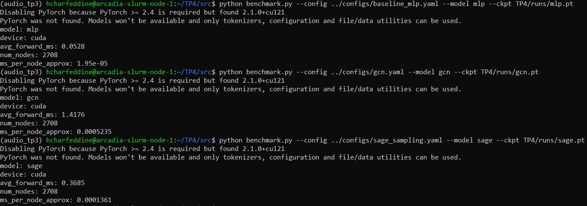

# TP4 – Deep learning pour audio

## Initialisation du TP et smoke test PyG (Cora)

> *python smoke_test.py*

## Baseline tabulaire : MLP (features seules) + entraînement et métriques

- train_mask sert à piloter le gradient (le modèle optimise uniquement sur ces 140 nœuds). 

- val_mask permet de surveiller la généralisation à chaque epoch sans toucher aux décisions finales : c'est là qu'on réglerait le learning rate ou le dropout si les courbes divergent. 

- test_mask n'est consulté qu'une fois, en fin d'entraînement, pour estimer la performance réelle sans biais de sélection. 

	- Mélanger les trois fausserait la mesure : un modèle qui "voit" le test pendant l'entraînement paraît meilleur qu'il ne l'est réellement.

## Baseline GNN : GCN (full-batch) + comparaison perf/temps

| Modèle | test_acc | test_f1 | total_train_time_s |
|--------|----------|---------|--------------------|
| MLP    | 0.5740   | 0.5634  | 0.86s              |
| GCN | 0.8030 | 0.7982 | 1.27s |

- Le GCN dépasse largement le MLP : +22.9 points d'accuracy (0.803 vs 0.574) et +23.6 points de Macro-F1 (0.799 vs 0.563), pour un coût quasi identique (+0.13s seulement). 

- Cora est un dataset à forte homophilie càd les nœuds connectés appartiennent très souvent à la même classe (articles citant des articles du même domaine). Le GCN exploite cette structure en agrégeant les features des voisins, ce qui revient à un "vote de voisinage" très efficace ici. Le MLP, qui ignore totalement edge_index, se retrouve à classer 2708 nœuds à partir de features bag-of-words (1433 dims) avec seulement 140 exemples d'entraînement , il overfit immédiatement (train_acc=1.0 dès epoch 20, val_acc stagne à ~0.55). Le signal du graphe compense donc massivement le manque de données labellisées, ce qui est précisément le cas d'usage idéal des GNN.

## GraphSAGE + neighbor sampling

> *python train.py --config ../configs/sage_sampling.yaml --model sage*

| Modèle    | test_acc | test_f1 | total_train_time_s |
|-----------|----------|---------|--------------------|
| MLP       | 0.5740   | 0.5634  | 0.86s              |
| GCN | 0.8030 | 0.7982 | 1.27s |
| GraphSAGE | 0.7400   | 0.7387  | 1.38s              |

- Le neighbor sampling remplace le passage full-batch par des mini-batches où chaque nœud seed agrège uniquement un sous-ensemble fixe de voisins (fanout l1=10, l2=10 ici). Cela borne la mémoire GPU à `batch_size × fanout^depth` indépendamment de la taille du graphe, rendant GraphSAGE scalable à des millions de nœuds là où GCN ne tient pas en mémoire. Le risque principal est la variance du gradient : ne voir qu'un sous-ensemble aléatoire des voisins par itération introduit du bruit dans les mises à jour (les nœuds "hubs" (très connectés) sont particulièrement impactés car leur représentation dépend fortement du tirage). 

- Un fanout trop petit (ex: 2) ralentit la convergence ; trop grand (ex: 50), le gain mémoire disparaît. Il existe aussi un coût CPU non négligeable pour construire les sous-graphes échantillonnés à chaque batch, qui peut devenir goulot d'étranglement sur GPU très rapide.

## Benchmarks ingénieur : temps d’entraînement et latence d’inférence (CPU/GPU)

> *python benchmark.py ...*

- Pourquoi warmup + synchronisation CUDA : Le GPU exécute les kernels de manière asynchrone càd sans `torch.cuda.synchronize()`, le chrono mesure uniquement le temps de lancement des kernels (quelques µs), pas le calcul réel. La synchronisation force l'attente de complétion avant de lire le chrono. Le warmup (10 itérations non mesurées) élimine les initialisations CUDA du premier forward qui fausseraient la mesure vers le haut.

## Synthèse Finale

| Modèle    | test_acc | test_macro_f1 | total_train_time_s | train_loop_time | avg_forward_ms |
|-----------|----------|---------------|--------------------|-----------------|----------------|
| MLP       | 0.5740   | 0.5634        | 0.87s              | 1.90s           | 0.0528         |
| GCN       | 0.8030   | 0.7982        | 1.27s              | 2.53s           | 1.4176         |
| GraphSAGE | 0.7400   | 0.7387        | 1.38s              | 2.46s           | 0.3685         |

**Recommandation ingénieur :**

- MLP est à exclure dès que la structure du graphe est disponible : il perd 23 points d'accuracy vs GCN pour un gain de temps négligeable (0.87s vs 1.27s). La latence MLP (0.05ms) est certes la plus faible, mais elle ne justifie pas la perte de qualité sur un problème à forte homophilie. GCN est le meilleur choix sur Cora : meilleure accuracy (0.803), meilleur F1 (0.798), et latence acceptable (1.42ms pour 2708 nœuds). GraphSAGE reste pertinent si le graphe dépasse la mémoire GPU disponible. Sa latence intermédiaire (0.37ms) s'explique par l'agrégateur SAGEConv. 

- En résumé : MLP si pas de graphe, GCN si graphe petit et stable, GraphSAGE+sampling si graphe grand ou dynamique.

**Risque de protocole :**

- Le principal risque est le biais de seed unique (seed=42) : les différences observées pourraient partiellement dépendre de l'initialisation, dans un vrai projet, on ferait 5 seeds et on reporterait moyenne +/- écart-type. 

- Un second risque est le data leakage transductif propre aux GNN : les nœuds de test sont connectés aux nœuds de train, donc GCN "voit" indirectement leurs features via les convolutions pendant l'entraînement. Ce n'est pas du leakage classique mais cela signifie que la performance test mesure aussi la qualité de la propagation transductive, pas uniquement la généralisation. 

- Enfin, les temps GPU mesurés ici (H100 MIG 10.75GB) ne seraient pas comparables à des mesures CPU, tous les runs étant sur le même device, la comparaison reste valide.

- Aucun fichier volumineux n'a été commité dans ce dépôt.