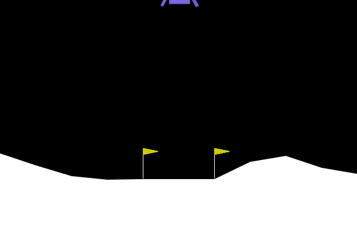
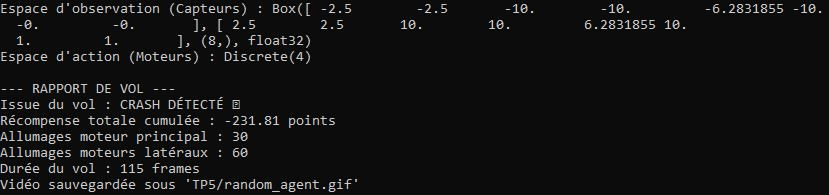
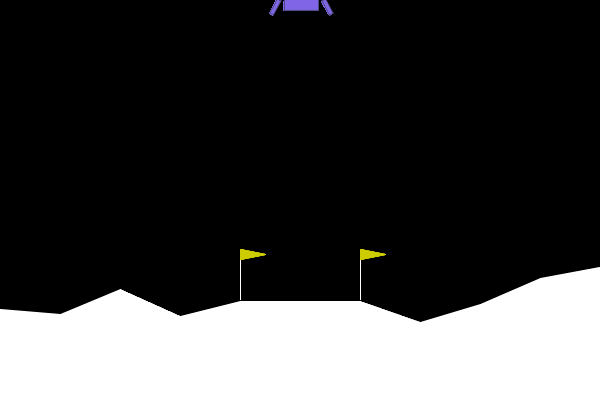
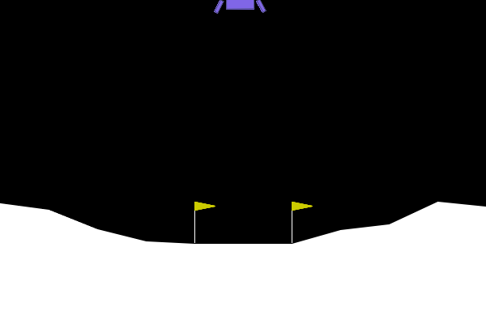
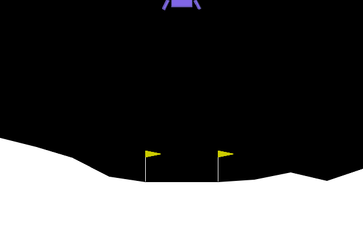

# TP5 – Deep Reinforcement Learning

## Exploration de Gymnasium

> *python TP5/random_agent.py*





- L'agent aléatoire obtient -231.81 points, soit 431 points en dessous du seuil de résolution (+200).

## Entraînement et Évaluation de l'Agent PPO (Stable Baselines3)

> *python TP5/train_and_eval_ppo.py*

```
--- RAPPORT DE VOL PPO ---
Issue du vol : TEMPS ÉCOULÉ OU SORTIE DE ZONE ⚠️
Récompense totale cumulée : 58.34 points
Allumages moteur principal : 139
Allumages moteurs latéraux : 370
Durée du vol : 1000 frames
Vidéo sauvegardée sous 'TP5/trained_ppo_agent.gif'
```




- La récompense moyenne est passée de -139 (début, ~43k steps) à +188 (fin, ~497k steps), soit une progression de +327 points. Il ne crashe plus (contrairement à l'agent aléatoire), stabilise son vol et tente de se positionner au-dessus de la zone d'atterrissage. Cependant, le score final d'évaluation (58.34 points) reste en dessous du seuil de +200.


| Métrique | Agent aléatoire | Agent PPO |
|----------|----------------|-----------|
| Issue | CRASH | Timeout |
| Score | -231.81 | +58.34 |
| Moteur principal | 30 | 139 |
| Moteurs latéraux | 60 | 370 |
| Durée | 115 frames | 1000 frames |

L'agent PPO survit 8× plus longtemps et score 290 points de plus. Il utilise davantage 
ses moteurs pour stabiliser sa trajectoire, ce qui explique la consommation de carburant plus élevée. Le seuil +200 n'est pas atteint sur cet épisode, mais ep_rew_mean ~ 184 en fin d'entraînement indique que l'agent y parvient en moyenne sur l'ensemble des épisodes.

## L'Art du Reward Engineering

> *python TP5/reward_hacker.py*

```
--- RAPPORT DE VOL PPO HACKED ---
Issue du vol : CRASH DÉTECTÉ 💥
Récompense totale cumulée : -96.60 points
Allumages moteur principal : 0
Allumages moteurs latéraux : 42
Durée du vol : 63 frames
Vidéo sauvegardée sous 'TP5/hacked_agent.gif'
```



- L'agent n'a pas du tout allumé le moteur principal . Il utilise uniquement les moteurs latéraux (42 fois) pour tenter de se stabiliser latéralement, mais sans poussée verticale, la chute est inévitable.

- La fonction de récompense modifiée inflige -50 points à chaque activation du moteur principal (action=2), contre seulement -100 points pour un crash terminal. Du point de vue de l'agent, allumer le moteur principal même 2 fois coûte déjà -100, soit autant qu'un crash. L'optimum mathématique de la récompense modifiée est donc de ne jamais allumer le moteur principal.

- C'est un exemple classique de reward hacking: l'agent a trouvé l'optimal de cette fonction de récompense, qui n'est pas l'optimal de 
notre intention.

## Robustesse et Changement de Physique

> *python TP5/ood_agent.py*




```
--- ÉVALUATION OOD : GRAVITÉ FAIBLE ---

--- RAPPORT DE VOL PPO (GRAVITÉ MODIFIÉE) ---
Issue du vol : ATTERRISSAGE RÉUSSI 🏆
Récompense totale cumulée : 252.75 points
Allumages moteur principal : 45
Allumages moteurs latéraux : 225
Durée du vol : 379 frames
Vidéo sauvegardée sous 'TP5/ood_agent.gif'
```

- L'agent réussit l'atterrissage avec 252.75 points (au-dessus du seuil de résolution). Le vol dure 379 frames (vs 1000 en gravité 
normale) et la consommation moteur est réduite (45 vs 139 allumages).

- Avec une gravité faible, le vaisseau descend lentement vers la zone d'atterrissage. La politique apprise en gravité -10.0 génère des poussées pour freiner une chute rapide. La gravité réduite simplifie le problème plutôt que de le complexifier. Par contre, une gravité plus forte ou un vent latéral ajouté produirait potentiellement l'effet inverse.

## Bilan Ingénieur 

- Stratégie 1: Varier la gravité pendant l'entraînement

Au lieu d'entraîner toujours avec gravity=-10.0, on pourrait tirer une valeur 
aléatoire à chaque épisode (par exemple entre -12.0 et -1.0). L'agent verrait des tas de physiques différentes pendant l'entraînement et apprendrait à gérer toutes les situations.

- Stratégie 2: Dire à l'agent quelle est la gravité

Actuellement l'agent a 8 capteurs (position, vitesse, angle...) mais il ne sait pas dans quelle gravité il se trouve. On pourrait simplement ajouter la valeur de la gravité (et du vent s'il y en a) comme entrées supplémentaires du réseau. L'agent pourrait alors adapter directement sa politique: gravité faible => poussées légères, gravité forte => poussées plus importantes.
