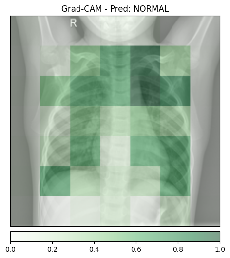
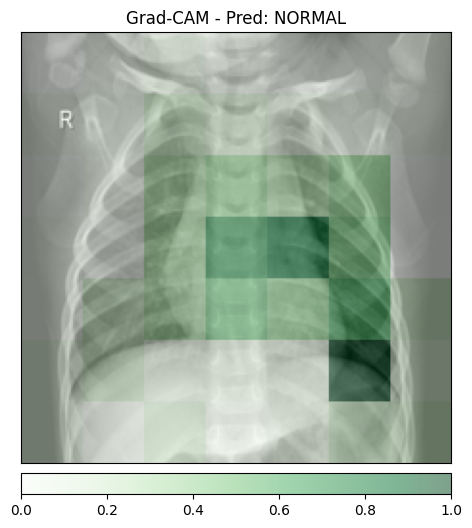
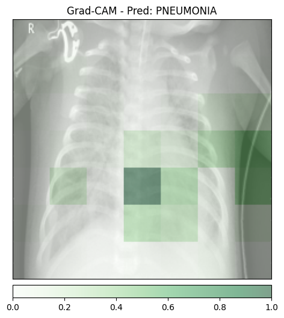
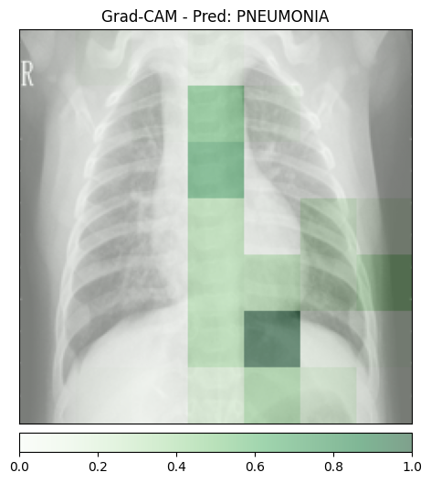
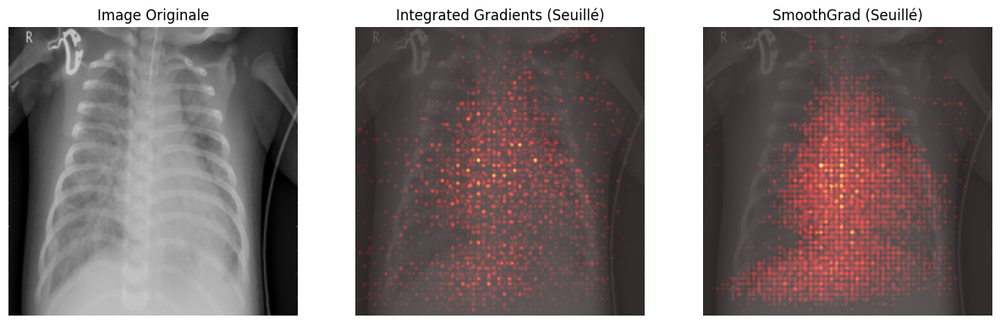
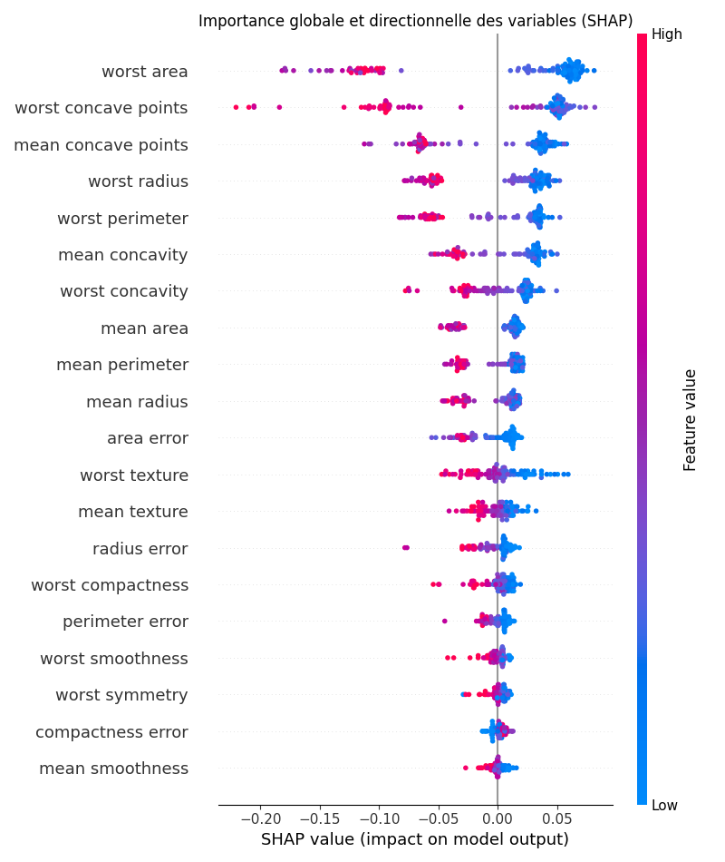

# TP6 – IA Explicable et Interprétable

## Mise en place, Inférence et Grad-CAM

> *python 01_gradcam.py normal_1.jpeg*

```
Temps d'inférence : 0.1455 secondes
Classe prédite : NORMAL
Temps d'explicabilité (Grad-CAM) : 0.4740 secondes
Visualisation sauvegardée dans gradcam_normal_1.png
```



> *python 01_gradcam.py normal_2.jpeg*

```
Temps d'inférence : 0.0132 secondes
Classe prédite : NORMAL
Temps d'explicabilité (Grad-CAM) : 0.0427 secondes
Visualisation sauvegardée dans gradcam_normal_2.png

```



> *python 01_gradcam.py pneumo_1.jpeg*

```
Temps d'inférence : 0.0205 secondes
Classe prédite : PNEUMONIA
Temps d'explicabilité (Grad-CAM) : 0.0628 secondes
Visualisation sauvegardée dans gradcam_pneumo_1.png
```



> *python 01_gradcam.py pneumo_2.jpeg*

```
Temps d'inférence : 0.0307 secondes
Classe prédite : PNEUMONIA
Temps d'explicabilité (Grad-CAM) : 0.0793 secondes
Visualisation sauvegardée dans gradcam_pneumo_2.png
```




- Les 4 images ont été correctement classifiées (normal_1 et normal_2 → NORMAL, pneumo_1 et pneumo_2 → PNEUMONIA). Contrairement à ce qu'attendait l'énoncé, pas de faux positif.

- Même si la prédiction est correcte, le modèle souffre bien d'un biais (effet Clever Hans). Il semble avoir appris à repérer l'équipement médical présent chez les patients malades, plutôt que de regarder uniquement l'opacité des poumonsn, notamment sur l'image `gradcam_pneumo_1` avec le câble.

- Les blocs sont flous car la dernière feature map de ResNet50 ne fait que 7×7 pixels (après les pooling successifs on a perdu trop de résolution spatiale pour avoir quelque chose de précis).


## Integrated Gradients et SmoothGrad

> *python 02_ig.py pneumo_1.jpeg*



```
Temps inférence : 0.0125s
Classe prédite : PNEUMONIA
Temps IG pur : 1.5741s
Temps SmoothGrad (IG x 100) : 14.3303s
Visualisation sauvegardée dans ig_smooth_pneumo_1.png
```

- 14 secondes c'est trop pour un médecin qui attend au premier clic. Une solution serait d'afficher d'abord le diagnostic immédiatement, puis calculer l'explication en arrière-plan via une file d'attente (ex: Celery + Redis) et l'envoyer quand c'est prêt.

- Grad-CAM applique un ReLU donc il ignore tout ce qui est négatif. IG garde les valeurs négatives, ce qui permet de voir aussi quels pixels jouent contre la prédiction, pas seulement ceux qui la favorisent.


## Modélisation Intrinsèquement Interprétable (Glass-box) sur Données Tabulaires

> *python 03_glassbox.py*

```
Accuracy de la Régression Logistique : 0.9737
Graphique sauvegardé dans glassbox_coefficients.png
```


- En observant le graphique, la caractéristique qui a le plus fort impact pour pousser la prédiction vers "Maligne" est worst texture, radius error et worst symmetry.

- L'avantage d'un modèle intrinsèquement interprétable c'est qu'on n'a pas besoin d'outil externe càd les coefficients sont l'explication directement.


## Explicabilité Post-Hoc avec SHAP sur un Modèle Complexe

> *python 04_shap.py*

```
Accuracy du Random Forest : 0.9649
Waterfall plot sauvegardé dans shap_waterfall.png
Summary plot sauvegardé dans shap_summary.png
```





- En observant le summary plot, on constate que les variables les plus importantes sont worst area, worst concave points et mean concave points. Bien que l'ordre exact diffère de la Régression Logistique (qui mettait worst texture en premier), on retrouve globalement le même groupe de variables critiques dans le top 10 des deux modèles. On en déduit que ces caractéristiques sont des biomarqueurs robustes, car ils restent déterminants pour la décision finale.

- En analysant le waterfall plot du patient 0, la caractéristique ayant le plus contribué à tirer la prédiction vers sa valeur finale (avec un impact de +0.07) est worst area. Pour ce patient, la valeur numérique de cette caractéristique est 677.9.


